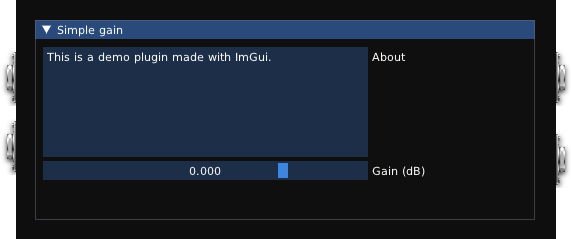

# DPF + ImGui + modgui template plugin project

This repository contains an example audio plugin project using DPF and ImGui, targetting [MOD Audio](https://mod.audio/) platform.



WORK IN PROGRESS!

Early instructions:

```sh
# 1. build moddwarf target in mod-plugin-builder
# 2. install and setup emscripten

# 3. import emscripten environment
source /path/to/emsdk/emsdk_env.sh

# 4. build for dwarf and create wasm modgui
make moddwarf

# 5. copy screenshot
cp screenshot.png thumbnail.png ./bin/mod-wasm-example.lv2/modgui/

# 6. deploy to moddwarf
make modpush
```
